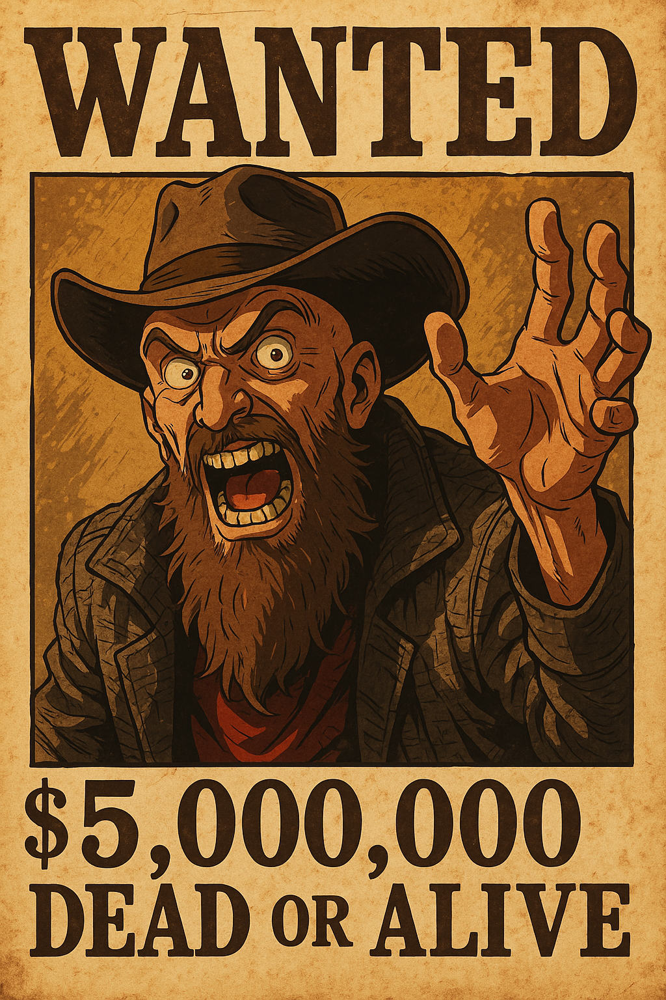

# woven-mind
A mad man's dream.

Woven Mind is a framework for building dynamic, hierarchical cognitive systems using Cognet schemas and EmoJSON. It allows for lightweight, emoji-based schema definitions and modular agent behaviors, enabling intuitive system design and flexible customization for AI-driven applications.

Key emojis are called keymojis. 
Non-key emojis are called semiotics.

Keymojis are the main agent types.

Semiotics are domain-specific augmentations applied to main agents according to context.

Both are defined in a database as MCML (see schema), with domain and revision columns.

Keymoji values are either strings or arrays. 

When Keymoji values are objects, these indicate scoped CogNet templates.

In the example below, two knowledge-base templates are defines for global scope before the main context is initiated.

```json
[{
    "💭": {
        "📚💭": [{
            "📚": []
        }, {
            "💭": "$1"
        }],
        "👥📚💭": [{
            "👥": "📚💭($1)"
        }, {
            "💭": "$2"
        }]
    },
    "📜": [{
        "💬": [{
            "👥": [{
                "💭": "🔁"
            }]
        }, {
            "💬": [{
                "💭": "🚀"
            }]
        }, {
            "💭": "🌌"
        }]
    }, {
        "💬": [{
            "🔍": [{
                "💭": "🧐"
            }]
        }, {
            "💆": "📚💭(👋)"
        }, {
            "💬": "👥📚💭(💼,✅)"
        }, {
            "💭": "🛰️"
        }]
    }, {
        "💑": [{
            "💆": "📚💭(🤔)"
        }, {
            "💬": [{
                "💭": "🚪"
            }]
        }, {
            "💭": "🏰"
        }]
    }, {
        "💬": "📚💭(🚶)"
    }, {
        "👥": [{
            "💬": "📚💭(🚶)"
        }, {
            "💆": [{
                "💭": "👩‍🎨"
            }]
        }]
    }, {
        "💬": [{
            "💆": "📚💭(📝)"
        }, {
            "💭": "🏝️"
        }]
    }, {
        "💑": [{
            "💆": [{
                "👥": [{
                    "💭": "🤔"
                }]
            }, {
                "💬": "📚💭(🎮)"
            }]
        }, {
            "💭": "👾"
        }]
    }, {
        "💬": [{
            "💑": "📚💭(🌳)"
        }, {
            "💆": "👥📚💭(🧔,🍃)"
        }]
    }, {
        "👥": [{
            "💆": [{
                "💭": "🤔"
            }]
        }, {
            "🤖": [{
                "💻": "base64"
            }]
        }]
    }, {
        "💬": [{
            "💆": [{
                "💭": "🌄"
            }]
        }, {
            "💭": "🌅"
        }]
    }, {
        "💑": [{
            "💆": "📚💭(🤔)"
        }, {
            "💬": "📚💭(🎹)"
        }, {
            "💭": "🎶"
        }]
    }, {
        "💑": [{
            "💆": [{
                "👥": [{
                    "💭": "💻"
                }]
            }, {
                "💬": "📚💭(📦)"
            }]
        }, {
            "💭": "🐳"
        }]
    }, {
        "🔍": [{
            "💆": "👥📚💭(📊,🔢)"
        }, {
            "💬": "📚💭(💹)"
        }, {
            "💭": "📉"
        }]
    }, {
        "👥": [{
            "💆": [{
                "👥": [{
                    "💭": "🤔"
                }]
            }, {
                "💬": "📚💭(📖)"
            }]
        }, {
            "💬": [{
                "👥": "📚💭(📖)"
            }, {
                "💆": [{
                    "💭": "📖"
                }]
            }]
        }]
    }, {
        "💑": [{
            "💆": "📚💭(🤔)"
        }, {
            "👥": "📚💭(🤖)"
        }]
    }, {
        "🔍": [{
            "💑": [{
                "💭": "🎬"
            }]
        }, {
            "💬": "📚💭(🎞️)"
        }, {
            "💬": [{
                "💭": "🎥"
            }]
        }]
    }, {
        "👥": [{
            "💬": [{
                "👥": [{
                    "💭": "🌄"
                }]
            }, {
                "💆": "📚💭(🚩)"
            }]
        }, {
            "💆": [{
                "💬": "📚💭(🏳️)"
            }, {
                "💭": "🌅"
            }]
        }]
    }, {
        "💬": [{
            "💆": [{
                "👥": [{
                    "📚": []
                }, {
                    "💭": {
                        "🌡": [{
                            "💬": "👥📚💭(🌡,📢🏗)"
                        }, {
                            "💬": "👥📚💭(🦜*,modifier*)"
                        }, {
                            "🤖": [{
                                "💻": "emojson"
                            }]
                        }, {
                            "💭": "🔝"
                        }]
                    }
                }, {
                    "💑": [{
                        "💬": "📚💭(🥁)"
                    }, {
                        "💭": "💤"
                    }]
                }, {
                    "💑": [{
                        "💆": [{
                            "💭": "📢🏗"
                        }]
                    }, {
                        "💬": [{
                            "💭": "💀"
                        }]
                    }, {
                        "🔍": "👥📚💭(📢🏗,🥜)"
                    }, {
                        "💆": [{
                            "💭": "🧠"
                        }]
                    }, {
                        "💬": "👥📚💭(🦜*,modifier*)"
                    }, {
                        "💬": [{
                            "💭": "🏗"
                        }]
                    }]
                }, {
                    "💬": [{
                        "💆": [{
                            "👥": [{
                                "💭": "&"
                            }]
                        }, {
                            "💬": "📚💭(&)"
                        }, {
                            "💭": "📢🏗"
                        }]
                    }, {
                        "👥": [{
                            "💬": "📚💭(🦜*)"
                        }, {
                            "💭": "📏*"
                        }]
                    }, {
                        "💑": "📚💭(🦜🔪)"
                    }, {
                        "💑": [{
                            "💬": "👥📚💭(&,✍️)"
                        }, {
                            "💆": [{
                                "💭": "🧠"
                            }]
                        }, {
                            "💬": "📚💭(🎭)"
                        }, {
                            "💑": [{
                                "💬": "👥📚💭(📢🏗,🦜)"
                            }, {
                                "💭": "😇"
                            }]
                        }]
                    }, {
                        "🔍": [{
                            "💬": "👥📚💭(🌡,🏋️‍♀️*)"
                        }, {
                            "💬": [{
                                "💭": "🥬"
                            }]
                        }, {
                            "💑": [{
                                "💬": "📚💭(🤷‍♂️)"
                            }, {
                                "💭": "✍️"
                            }]
                        }, {
                            "💑": [{
                                "💬": "📚💭(✍️)"
                            }, {
                                "💭": "💤"
                            }]
                        }]
                    }, {
                        "👥": [{
                            "💬": "👥📚💭(🥫,💤)"
                        }, {
                            "💆": [{
                                "📚": []
                            }, {
                                "💭": "emojson"
                            }]
                        }, {
                            "💬": "👥📚💭(📢🏗*,👍)"
                        }, {
                            "💆": [{
                                "💬": "👥📚💭(🌡,🔥)"
                            }, {
                                "💭": "💬"
                            }]
                        }]
                    }, {
                        "👥": [{
                            "💬": "📚💭(🥦*)"
                        }, {
                            "💭": "🏋️‍♀️*"
                        }]
                    }, {
                        "💬": [{
                            "🔍": [{
                                "💭": "📢🏗"
                            }]
                        }, {
                            "💭": "🌡*"
                        }]
                    }, {
                        "💬": [{
                            "💬": "👥📚💭(💀,&)"
                        }, {
                            "🔍": [{
                                "💭": "🌡"
                            }]
                        }, {
                            "👥": [{
                                "💬": "📚💭(🔪)"
                            }, {
                                "💭": "modifier*"
                            }]
                        }, {
                            "💬": [{
                                "👥": "📚💭(️⃣)"
                            }, {
                                "💆": "📚💭(🏧)"
                            }, {
                                "💭": "📏"
                            }]
                        }, {
                            "💑": [{
                                "💬": "👥📚💭(🕒,modifier*)"
                            }, {
                                "💭": "4"
                            }]
                        }, {
                            "💑": [{
                                "👥": "📚💭(👔al)"
                            }, {
                                "💆": [{
                                    "💬": "📚💭(🪀ing)"
                                }, {
                                    "💭": "☝"
                                }]
                            }, {
                                "💭": "🛒"
                            }]
                        }, {
                            "💬": [{
                                "👥": "📚💭(🤖)"
                            }, {
                                "💆": "📚💭(📆)"
                            }, {
                                "💆": "📚💭(🍆)"
                            }, {
                                "💭": "👍"
                            }]
                        }, {
                            "💬": [{
                                "💆": "📚💭(🧲)"
                            }, {
                                "💆": "📚💭(🐘)"
                            }, {
                                "💭": "👩"
                            }]
                        }, {
                            "💬": "📚💭(🚂)"
                        }, {
                            "🔍": [{
                                "💬": "📚💭(🍲)"
                            }, {
                                "💭": "modifier*"
                            }]
                        }, {
                            "💬": [{
                                "💆": "📚💭(🚆)"
                            }, {
                                "💭": "📏*"
                            }]
                        }, {
                            "💑": [{
                                "💆": [{
                                    "💬": "📚💭(🚂)"
                                }, {
                                    "💭": "👨"
                                }]
                            }, {
                                "💭": "4"
                            }]
                        }, {
                            "💑": "📚💭(🧔)"
                        }, {
                            "💬": [{
                                "💆": "👥📚💭(🚊,👁️‍🗨️)"
                            }, {
                                "💭": "🐖"
                            }]
                        }, {
                            "💬": "📚💭(🍕)"
                        }, {
                            "💬": [{
                                "👥": "📚💭(👨‍🦳)"
                            }, {
                                "💆": [{
                                    "💬": "📚💭(🕦)"
                                }, {
                                    "💭": "&"
                                }]
                            }, {
                                "💭": "🔝"
                            }]
                        }, {
                            "🔍": [{
                                "💬": "📚💭(👀)"
                            }, {
                                "💭": "&"
                            }]
                        }, {
                            "👥": [{
                                "💆": "📚💭(🍆)"
                            }, {
                                "💭": "&"
                            }]
                        }, {
                            "💬": "📚💭(🏋️‍♂️)"
                        }]
                    }, {
                        "😊": []
                    }]
                }]
            }]
        }]
    }]
}]
```


